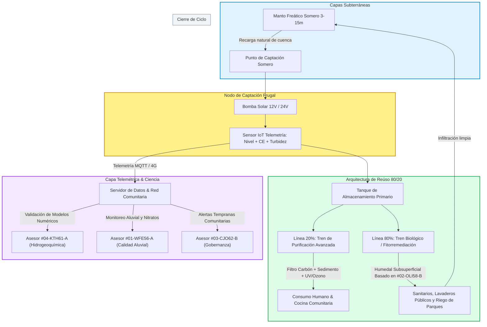
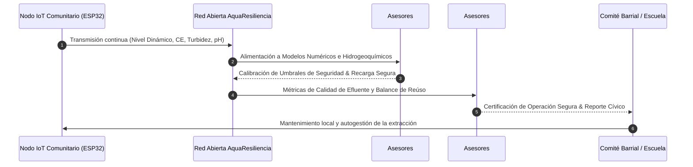

# 🌊 MATRIZ DE ASESORES CIENTÍFICOS Y ARQUITECTURA DE SISTEMAS
## Proyecto AquaResiliencia — Red Comunitaria y Telemétrica de Aguas Someras

> **Documento de Inteligencia y Gobernanza Técnica**  
> **Origen:** Transcripción y análisis del registro conceptual `asinaceaquaresilencia.mp4` / `como nace aquaresilencia.m4a`  
> **Fecha de Emisión:** 1 de Septiembre, 2026  
> **Confidencialidad:** Identidades anonimizadas bajo estándar de codificación estructurada.

---

### 1. 🧠 Mapa Mental: Ecosistema AquaResiliencia

```mermaid
mindmap
  root((AquaResiliencia))
    (1) Crisis & Urgencia
      Día Cero Presa Hoover
        Ventana crítica ~1,128 días
      Fallas del Modelo Centralizado
        Cortes recurrentes y tandeos
        Monopolio de pipas con costo x8
      Agotamiento de Acuíferos Profundos
        Pozos 40-150m con costos >$100k USD
    (2) Solución Técnica Frugal
      Micro-pozos Someros
        Profundidad 3 a 15 metros
        Costo de instalación ~$10,000 MXN
      Energía Limpia & Descentralizada
        Bombeo solar fotovoltaico 12V/24V
      Marco Legal Art. 40 y 41 LGA
        Extracción doméstica amparada <=150 m3/año
        ~2 tambos azules diarios por núcleo familiar
    (3) Telemetría & Red IoT
      Hardware Abierto
        Microcontroladores Arduino / ESP32
      Sensores Clave en Tiempo Real
        Conductividad Eléctrica CE / Salinidad
        Nivel dinámico del manto freático
        Sensor de turbidez y pH
      Capa de Datos Abiertos
        Alimentación a modelos numéricos de asesores #04 y #01
    (4) Nodos Comunitarios de Vida
      Separación 80 / 20
        20% Tratamiento estricto purificación consumo
        80% Fitorremediación y biofiltros riego/sanitarios
      Espacios Ancla
        Escuelas, parques públicos, lavaderos comunitarios
      Resiliencia Social
        Comités vecinales de autogestión hídrica
    (5) Respaldo Científico Codificado
      #01-WFE56-A: Dinámica aluvial y filtración nitratos
      #02-OLI58-B: Fitodepuración y biofiltros urbanos
      #03-CJO62-B: Gobernanza y justicia hídrica
      #04-KTH61-A: Hidrogeoquímica e intrusión salina
      #05-DHE65-C: Infraestructura macro y reúso
      #06-CAL63-C: Políticas y cuenca transfronteriza
```

---

### 2. 🏗️ Diagrama de Arquitectura de Sistemas y Flujo Hídrico



---

### 3. 📋 Catálogo Codificado de Asesores Científicos

#### Estructura de la Nomenclatura del Código ID:
$$\mathbf{[N^\circ \text{ de Llegada}]} - \mathbf{[1^\text{ra} \text{ Letra Apellido}]} + \mathbf{[2 \text{ Primeras Letras Nombre}]} + \mathbf{[\text{Edad Aprox.}]} - \mathbf{[\text{Nivel de Importancia (A-D)}]}$$

#### Criterio de Clasificación de Importancia:
* **Nivel A (Crítico):** Aporte indispensable de modelado numérico, física/química hidrogeológica y calibración telemétrica de campo.
* **Nivel B (Alto Impacto):** Metodología de biofiltros/reúso comprobada y blindaje cívico-legal bajo la Ley General de Aguas.
* **Nivel C (Estratégico / Sectorial):** Visión macro de cuenca, tratados binacionales y diálogo con organismos operadores históricos.
* **Nivel D (Colaboración Territorial):** Redes ciudadanas, comités vecinales y soporte logístico.

---

### 📊 Tabla Matriz de Asesores

| Código ID | Especialidad Técnica | Institución / Afiliación | Aporte Específico al Proyecto | Nivel | Justificación de Prioridad |
| :--- | :--- | :--- | :--- | :---: | :--- |
| **`#01-WFE56-A`** | Hidrogeoquímica Aluvial y Dinámica de Nitratos | UABC (FCQI) | Estudios de transporte de solutos en el aluvión del Río Tijuana/Alamar; diseño de sellos sanitarios (>2.5m) y prefiltros de zeolita/carbón. | **A** | **Crítico:** Valida la seguridad química del agua somera aluvial y define las directrices de prefiltración mecánica. |
| **`#02-OLI58-B`** | Fitorremediación y Tratamiento Biológico Descentralizado | El Colef (Ecoparque) | Diseño y transferencia del modelo experimental de humedales subsuperficiales para la fracción 80% (riego y saneamiento con consumo energético <0.4 kWh/$m^3$). | **B** | **Alto Impacto:** Respaldo de más de 2 décadas en soluciones basadas en la naturaleza para el Sistema Metropolitano de Parques. |
| **`#03-CJO62-B`** | Gobernanza Hídrica y Justicia Socio-Espacial | El Colef (DEUMA) | Estructuración legal de los Comités Comunitarios de Agua (Art. 40 y 41 LGA); cartografía de vulnerabilidad frente al sobrecosto de pipas. | **B** | **Alto Impacto:** Provee el marco de gobernanza social que legitima el proyecto frente a instituciones y convocatorias de financiamiento. |
| **`#04-KTH61-A`** | Modelado Hidrogeológico, Isótopos e Intrusión Salina | CICESE (Geología) | Caracterización de fuentes de recarga profunda vs somera, mecanismos de salinidad geológica costera; calibración de algoritmos de alerta en sensores CE. | **A** | **Crítico:** Provee el respaldo de modelado numérico para conectar la red telemétrica IoT con publicaciones científicas arbitradas. |
| **`#05-DHE65-C`** | Infraestructura Operativa de Red y Proyectos de Reúso | Tijuana Verde / Ex-CESPT | Perspectiva histórica de la infraestructura de bombeo, experiencia en el Proyecto Morado y vinculación con cámaras industriales y el CDT. | **C** | **Estratégico:** Facilita el puente de diálogo con el sector empresarial y los organismos operadores de agua de la región. |
| **`#06-CAL63-C`** | Gobernanza de Cuenca del Río Colorado y Tratados CILA | El Colef (Mexicali) | Análisis de estrés hídrico macro-regional, proyecciones del Día Cero en el sistema del Río Colorado y acuerdos de entrega transfronteriza. | **C** | **Estratégico:** Brinda el sustento geopolítico y macroeconómico sobre la urgencia de fuentes descentralizadas locales. |

---

### 4. 🔄 Matriz de Interacción: Telemetría IoT vs Validación Científica



---
*Fin del Documento Técnico — AquaResiliencia 2026*
