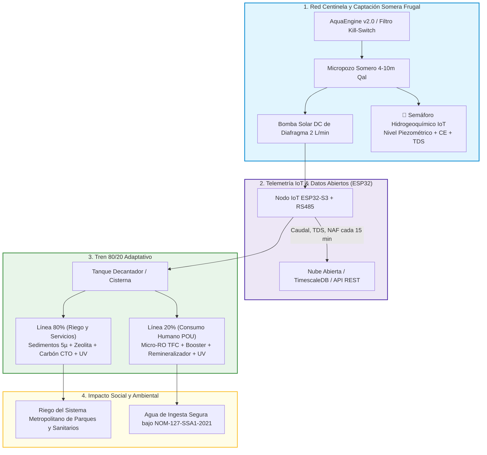

# 💧 AquaResiliencia Tijuana / Agua de GIA

<div align="center">

[](https://quecrap.github.io/123portijuana/)
[](https://quecrap.github.io/123portijuana/)
[](https://quecrap.github.io/123portijuana/)
[](https://quecrap.github.io/123portijuana/)
[](https://quecrap.github.io/123portijuana/)

**Plataforma de Inteligencia Territorial, Red Centinela de Aguas Someras, Tratamiento POU 80/20 Adaptativo y Telemetría Regulada IoT.**

*Transformando el conocimiento hidrogeológico de la cuenca binacional del Río Tijuana en una infraestructura científica, ciudadana y tecnológicamente viable.*

---

</div>

## 🌐 Portal Oficial del Proyecto
Accede a la plataforma web interactiva con el visor geocientífico multicriterio (**AquaEngine v2.0**), inventario del Sistema Metropolitano de Parques (SMP) y tablero de validación comunitaria:  
👉 **[https://quecrap.github.io/123portijuana/](https://quecrap.github.io/123portijuana/)**  
👉 **[Visor de Parques y Nodos Piloto (candidatos.html)](https://quecrap.github.io/123portijuana/candidatos.html)**

---

## 📑 Tabla de Contenidos

1. [Visión y Mensaje Maestro](#-visión-y-mensaje-maestro)
2. [Investigación Científica e Hidrogeología Oficial (Acuífero 0201)](#-investigación-científica-e-hidrogeología-oficial-acuífero-0201)
3. [La Cuádruple Hélice Científica Regional](#-la-cuádruple-hélice-científica-regional)
4. [Arquitectura del Sistema y Red Centinela IoT](#-arquitectura-del-sistema-y-red-centinela-iot)
5. [El Modelo 80/20 Adaptativo](#-el-modelo-8020-adaptativo)
6. [Marco Jurídico Vigente: Ley General de Aguas (Dic 2025)](#-marco-jurídico-vigente-ley-general-de-aguas-dic-2025)
7. [Red Piloto Experimental (8 Nodos)](#-red-piloto-experimental-8-nodos)
8. [Estructura del Repositorio](#-estructura-del-repositorio)

---

## 🎯 Visión y Mensaje Maestro

> **"Frente a la vulnerabilidad de depender en más de un 90% del Acueducto Río Colorado–Tijuana (que gasta ~7.5 kWh/m³ cruzando La Rumorosa), AquaResiliencia construye una red científica y comunitaria de captación somera (1 a 10 m), monitoreo telemétrico continuo y tratamiento modular in-situ para dotar de autonomía hídrica a los parques urbanos y colonias periféricas de Tijuana."**

El proyecto combina cinco pilares rigurosos:
- **Inteligencia Territorial Multicriterio (AquaEngine):** Modelo AHP que cruza topografía LiDAR (INEGI), formaciones geológicas (SGM), piezometría oficial (CONAGUA), redes hidrográficas y polígonos de riesgo geotécnico (Protección Civil con *Kill Switch* para fallas activas).
- **Extracción Frugal Asistida (AquaDrill):** Micropozos someros en aluvión ($Qal$) y areniscas con ademe ranurado fino (0.020''), sello sanitario de 2.5 m y bombas solares DC de bajo caudal ($\le 2.5\text{ L/min}$) para evitar arrastre de finos.
- **Tratamiento POU 80/20 Adaptativo:** Línea de bajo costo (80%) para riego y servicios con biofiltración/zeolitas/carbón + micro-ósmosis inversa y radiación UV (20%) para agua de consumo humano bajo norma **NOM-127-SSA1-2021**.
- **Red Centinela IoT:** Nodos ESP32 de bajo consumo transmitiendo nivel freático, conductividad eléctrica (CE/TDS), temperatura y caudal cada 15 minutos.
- **Gobernanza bajo la Ley General de Aguas (2025):** Operación respaldada en los Artículos 35 (Investigación Científica), 38 (Monitoreo Ciudadano) y 40-41 (Sistemas Comunitarios de Agua), respetando la Veda Tipo III de 1965.

---

## 🌊 Investigación Científica e Hidrogeología Oficial (Acuífero 0201)

El proyecto se fundamenta en el estudio técnico **DR_0201 de CONAGUA** y publicaciones en el Diario Oficial de la Federación (DOF):

```
                               BALANCE HIDROLÓGICO OFICIAL CONAGUA (ACUÍFERO 0201)
┌───────────────────────────────────────────────────┬──────────────┬─────────────┬───────────────────────────┐
│ Parámetro de Balance                              │ Símbolo      │ Valor Oficial│ Unidad                    │
├───────────────────────────────────────────────────┼──────────────┼─────────────┼───────────────────────────┤
│ Superficie Oficial del Acuífero                   │ Superficie   │ 1,180.20    │ km²                       │
│ Recarga Total Media Anual                         │ R            │ 19.50       │ Millones de m³/año (hm³) │
│ Descarga Natural Comprometida                     │ DNC          │ 4.60        │ Millones de m³/año (hm³) │
│ Volumen de Extracción de Aguas Subterráneas (REPDA)│ VEAS         │ 14.893271   │ Millones de m³/año (hm³) │
│ Disponibilidad Media Anual de Agua Subterránea    │ DMA          │ -1.664020   │ Millones de m³/año (hm³) │
│ Condición Administrativa Oficial                  │ Condición    │ DÉFICIT     │ Déficit = -1.66 hm³/año   │
└───────────────────────────────────────────────────┴──────────────┴─────────────┴───────────────────────────┘
```

👉 Consulta el documento maestro: [**INVESTIGACION_CIENTIFICA_Y_MATRIZ_HIDROGEOLOGICA.md**](INVESTIGACION_CIENTIFICA_Y_MATRIZ_HIDROGEOLOGICA.md)

---

## 🔬 La Cuádruple Hélice Científica Regional

AquaResiliencia operacionaliza y complementa en campo las investigaciones de los líderes académicos de Baja California:

| Investigador / Centro | Línea de Investigación Clave | Aporte Directo de AquaResiliencia |
| :--- | :--- | :--- |
| **Dr. Fernando Toyohiko Wakida**<br>*(UABC - FCQI)* | Dinámica de contaminantes río-acuífero en Arroyo Alamar, nitratos y metales pesados. | Series de datos de alta frecuencia y validación de prefiltros de zeolita en campo. |
| **Dra. Lina Ojeda Revah**<br>*(El Colef / Ecoparque)* | Tratamiento descentralizado, humedales construidos y soluciones basadas en la naturaleza. | Extensión del modelo Ecoparque con micro-sensores IoT para el Sistema Metropolitano de Parques. |
| **Dr. José Luis Castro Ruiz**<br>*(El Colef)* | Gobernanza de cuenca, asimetrías sociales y justicia hídrica frente al monopolio centralizado. | Infraestructura cívica de datos abiertos para comités comunitarios de agua (Art. 40 LGA). |
| **Dr. Thomas Gunter Kretzschmar**<br>*(CICESE - Geología)* | Hidrogeoquímica, isótopos ambientales ($\delta^{18}\text{O}, ^3\text{H}$) y salinización de acuíferos costeros. | Telemetría continua de conductividad eléctrica (CE) para calibrar modelos de intrusión salina. |

---

## ⚙️ Arquitectura del Sistema y Red Centinela IoT



---

## 🧪 El Modelo 80/20 Adaptativo

```
                       REGLAS DE CONTROL DEL TREN 80/20 ADAPTATIVO
┌─────────────────────────┬─────────────────────────┬──────────────────────────────────────────┐
│ Condición Hidrogeoquímica│ Estatus de Ósmosis (RO) │ Configuración Operativa del Sistema      │
├─────────────────────────┼─────────────────────────┼──────────────────────────────────────────┤
│ TDS < 900 mg/L y        │ RO = INNECESARIA        │ Tren 100/0: Filtración Sedimentos 5µ     │
│ As < 0.01 / F < 1.5 mg/L│                         │ + Zeolita + Carbón Block + Lámpara UV    │
├─────────────────────────┼─────────────────────────┼──────────────────────────────────────────┤
│ TDS 900 a 1,800 mg/L o  │ RO = CONVENIENTE        │ Tren 80/20 Estándar: 80% Filtración Frugal│
│ Dureza > 400 mg/L       │                         │ + 20% Micro-RO para agua de beber        │
├─────────────────────────┼─────────────────────────┼──────────────────────────────────────────┤
│ TDS > 1,800 mg/L o      │ RO = OBLIGATORIA        │ Tren 60/40 Reforzado: Pre-ablandamiento  │
│ As > 0.01 / F > 1.5 mg/L│                         │ + Micro-RO con recirculación forzada     │
└─────────────────────────┴─────────────────────────┴──────────────────────────────────────────┘
```

---

## ⚖️ Marco Jurídico Vigente: Ley General de Aguas (Dic 2025)

El proyecto opera con estricto apego al marco legal publicado en el **Diario Oficial de la Federación el 11 de diciembre de 2025**:
1. **Artículo 35 de la LGA (Investigación Científica e Innovación Tecnológica):** Faculta el desarrollo de redes de monitoreo hidrogeológico y desarrollo de tecnología de bajo impacto para el rescate de acuíferos.
2. **Artículo 38 de la LGA (Monitoreo Ciudadano y Datos Abiertos):** Reconoce formalmente los esquemas de ciencia cívica y convenios con universidades para la recopilación de datos de calidad del agua.
3. **Artículos 40 y 41 de la LGA (Sistemas Comunitarios de Agua y Saneamiento):** Establece el reconocimiento legal de los comités comunitarios sin fines de lucro para abastecimiento y saneamiento de supervivencia en zonas periurbanas no cubiertas por redes centrales.
4. **Decreto de Veda del 15 de mayo de 1965 (Veda Tipo III):** Regula las extracciones en la cuenca de Tijuana permitiendo captaciones de bajo impacto doméstico y servicios públicos.

---

## 📍 Red Piloto Experimental (8 Nodos)

```
┌────────────┬───────────────────────────────────┬──────────────┬──────────────┬───────────────────────────────┐
│ ID Nodo    │ Ubicación Territorial             │ Coordenadas  │ Profundidad  │ Categoría y Función           │
├────────────┼───────────────────────────────────┼──────────────┼──────────────┼───────────────────────────────┤
│ PILOTO-01  │ Parque Morelos (Sistema SMP)      │ 32.50, -116.93│ 6.0 - 8.0 m  │ Cat. B: Riego Parque Urbano   │
│ PILOTO-02  │ Arroyo Alamar (Murúa)             │ 32.53, -116.94│ 4.5 - 6.5 m  │ Cat. A: Investigación UABC    │
│ PILOTO-03  │ Ecoparque (Mesa de Otay)          │ 32.53, -116.99│ 8.0 - 12.0 m │ Cat. B: Validación Fitopulido │
│ PILOTO-04  │ Cañón del Sainz                   │ 32.42, -116.94│ 5.0 - 9.0 m  │ Cat. C: Sistema Comunitario   │
│ PILOTO-05  │ Playas de Tijuana (Los Sauces)    │ 32.52, -117.11│ 3.5 - 5.5 m  │ Cat. A: Monitoreo Cuña Salina │
│ PILOTO-06  │ Parque de la Amistad (Otay)       │ 32.54, -116.95│ 12.0 - 18.0 m│ Cat. B: Riego y Monitoreo VOCs│
│ PILOTO-07  │ Maclovio Rojas (Zona Este)        │ 32.48, -116.79│ 7.0 - 11.0 m │ Cat. C: Abasto Comunitario    │
│ PILOTO-08  │ Estación Binacional (CILA/USGS)   │ 32.54, -117.08│ 3.0 - 5.0 m  │ Cat. A: Calibración USGS      │
└────────────┴───────────────────────────────────┴──────────────┴──────────────┴───────────────────────────────┘
```

---

## 📁 Estructura del Repositorio

```
123portijuana/
├── index.html                                        # Portal web principal con AquaEngine v2.0 y mapa SIG
├── candidatos.html                                   # Visor interactivo de los 8 nodos piloto y parques SMP
├── INVESTIGACION_CIENTIFICA_Y_MATRIZ_HIDROGEOLOGICA.md # Expediente científico maestro (17 Fases)
├── GESTION_URBANA_AGUAS_SOMERAS_DERECHO_COMPARADO.md # Derecho comparado (Berlín, San Diego, Lima, Miami)
├── FUENTES_OFICIALES_CARTOGRAFIA_Y_CAPAS_ALTERNATIVAS.md # Fuentes geocientíficas (SGM, INEGI, CILA)
├── INVESTIGACION_HISTORICA_DURAN_CESPT_ESTRATEGIA.md # Análisis de gestión histórica y correos de vinculación
├── ORDEN_DE_COMPRA_IOT_ESP32.md                      # BOM de hardware y sensores telemétricos
├── PLAN_MAESTRO.md                                   # Documento maestro técnico y financiero
├── README.md                                         # Documento de presentación principal
└── firmware/                                         # Código fuente para microcontroladores ESP32-S3
```

---

### 🛡️ Transparencia y Rigor
* **Portal Activo:** [https://quecrap.github.io/123portijuana/](https://quecrap.github.io/123portijuana/)
* **Contacto Institucional:** `tijuana@aquaresiliencia.org` | Coordinación de Investigación y Vinculación Tecnológica.
