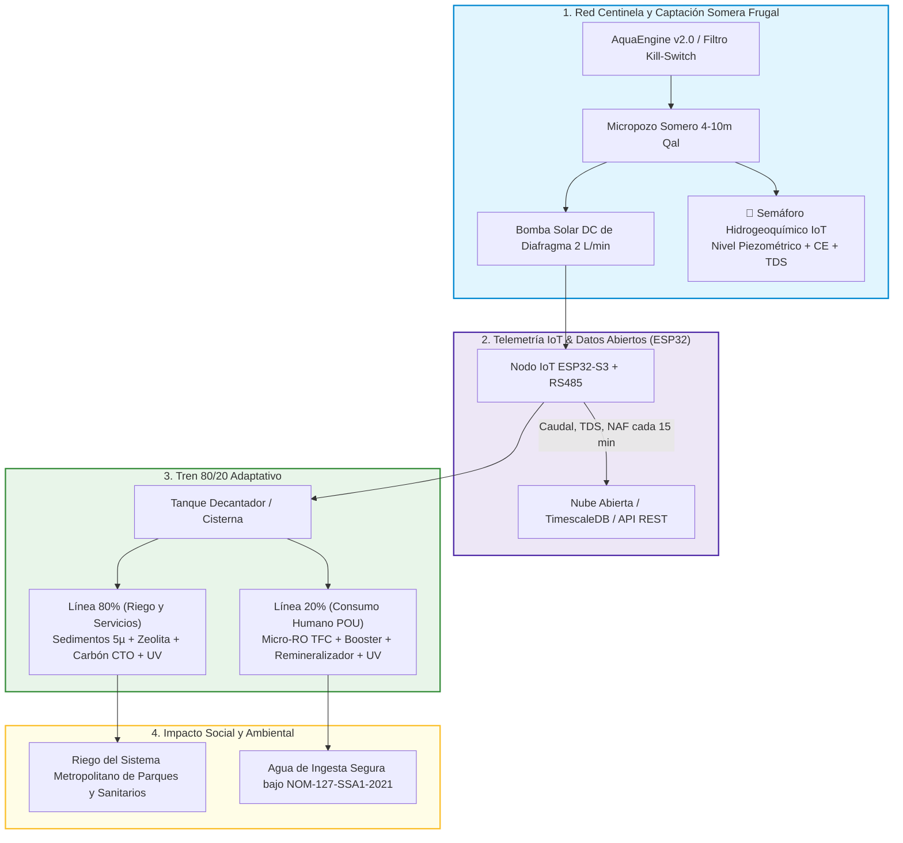

# 💧 AquaResiliencia Tijuana / Agua de GIA

<div align="center">

[](https://quecrap.github.io/123portijuana/)
[](https://quecrap.github.io/123portijuana/)
[](https://quecrap.github.io/123portijuana/)
[](https://quecrap.github.io/123portijuana/)
[](https://quecrap.github.io/123portijuana/)

**Plataforma de Inteligencia Territorial, Red Centinela de Aguas Someras, Tratamiento POU 80/20 Adaptativo y Telemetría Regulada IoT.**

*Transformando el conocimiento hidrogeológico de la cuenca binacional del Río Tijuana en una infraestructura científica, ciudadana y tecnológicamente viable.*

---

</div>

## 🌐 Portal Oficial del Proyecto
Accede a la plataforma web interactiva con el visor geocientífico multicriterio (**AquaEngine v2.0**), inventario del Sistema Metropolitano de Parques (SMP) y tablero de validación comunitaria:  
👉 **[https://quecrap.github.io/123portijuana/](https://quecrap.github.io/123portijuana/)**  
👉 **[Visor de Parques y Nodos Piloto (candidatos.html)](https://quecrap.github.io/123portijuana/candidatos.html)**

---

## 📑 Tabla de Contenidos

1. [Visión y Mensaje Maestro](#-visión-y-mensaje-maestro)
2. [Investigación Científica e Hidrogeología Oficial (Acuífero 0201)](#-investigación-científica-e-hidrogeología-oficial-acuífero-0201)
3. [Investigadores Regionales Relevantes (alineación propuesta, aún sin colaboración formal)](#-investigadores-regionales-relevantes-alineación-propuesta-aún-sin-colaboración-formal)
4. [Arquitectura del Sistema y Red Centinela IoT](#-arquitectura-del-sistema-y-red-centinela-iot)
5. [El Modelo 80/20 Adaptativo](#-el-modelo-8020-adaptativo)
6. [Marco Jurídico de Referencia: Ley General de Aguas (Dic 2025)](#-marco-jurídico-de-referencia-ley-general-de-aguas-dic-2025)
7. [Red Piloto Propuesta: Sitios Candidato (8, aún no instalados)](#-red-piloto-propuesta-sitios-candidato-8-aún-no-instalados)
8. [Estructura del Repositorio](#-estructura-del-repositorio)

---

## 🎯 Visión y Mensaje Maestro

> **"Frente a la vulnerabilidad de depender en más de un 90% del Acueducto Río Colorado–Tijuana (que gasta ~7.5 kWh/m³ cruzando La Rumorosa), AquaResiliencia propone construir una red científica y comunitaria de captación somera (1 a 10 m), monitoreo telemétrico continuo y tratamiento modular in-situ para dotar de autonomía hídrica a los parques urbanos y colonias periféricas de Tijuana."**

El proyecto combina cinco líneas de trabajo, hoy en distintas etapas de avance (validado en campo con un pozo piloto desde 2022; el resto, diseño y propuesta en construcción):
- **Inteligencia Territorial Multicriterio (AquaEngine):** Modelo AHP que cruza topografía LiDAR (INEGI), formaciones geológicas (SGM), piezometría oficial (CONAGUA), redes hidrográficas y polígonos de riesgo geotécnico (Protección Civil con *Kill Switch* para fallas activas).
- **Extracción Frugal Asistida (AquaDrill):** Micropozos someros en aluvión ($Qal$) y areniscas con ademe ranurado fino (0.020''), sello sanitario de 2.5 m y bombas solares DC de bajo caudal ($\le 2.5\text{ L/min}$) para evitar arrastre de finos.
- **Tratamiento POU 80/20 Adaptativo:** Línea de bajo costo (80%) para riego y servicios con biofiltración/zeolitas/carbón + micro-ósmosis inversa y radiación UV (20%) para agua de consumo humano bajo norma **NOM-127-SSA1-2021**.
- **Red Centinela IoT:** Nodos ESP32 de bajo consumo, propuestos para transmitir nivel freático, conductividad eléctrica (CE/TDS), temperatura y caudal cada 15 minutos — **diseño de telemetría en desarrollo, aún no instalado en campo**.
- **Alineación con la Ley General de Aguas (2025):** el proyecto busca operar en congruencia con el espíritu de los Artículos 35, 40 y 41 (ver sección de Marco Jurídico), respetando la Veda Tipo III de 1965 — su Reglamento de aplicación sigue pendiente de publicación.

---

## 🌊 Investigación Científica e Hidrogeología Oficial (Acuífero 0201)

El proyecto se fundamenta en el estudio técnico **DR_0201 de CONAGUA** ([fuente oficial](https://sigagis.conagua.gob.mx/gas1/Edos_Acuiferos_18/BajaCalifornia/DR_0201.pdf)):

```
                               BALANCE HIDROLÓGICO OFICIAL CONAGUA (ACUÍFERO 0201)
┌───────────────────────────────────────────────────┬──────────────┬─────────────┬───────────────────────────┐
│ Parámetro de Balance                              │ Símbolo      │ Valor Oficial│ Unidad                    │
├───────────────────────────────────────────────────┼──────────────┼─────────────┼───────────────────────────┤
│ Superficie Oficial del Acuífero                   │ Superficie   │ 245.00      │ km²                       │
│ Recarga Total Media Anual                         │ R            │ 19.50       │ Millones de m³/año (hm³) │
│ Descarga Natural Comprometida                     │ DNC          │ 4.60        │ Millones de m³/año (hm³) │
│ Volumen de Extracción de Aguas Subterráneas (REPDA, corte 30-dic-2022) │ VEAS │ 16.564020 │ Millones de m³/año (hm³) │
│ Disponibilidad Media Anual de Agua Subterránea    │ DMA          │ -1.664020   │ Millones de m³/año (hm³) │
│ Condición Administrativa Oficial                  │ Condición    │ DÉFICIT     │ Déficit = -1.66 hm³/año   │
└───────────────────────────────────────────────────┴──────────────┴─────────────┴───────────────────────────┘
```
*(Superficie y VEAS corregidos el 11-sep-2026 tras verificar directamente el documento DR_0201: la superficie oficial del acuífero es de 245 km², no 1,180 km²; el VEAS reportado en REPDA a corte 30-dic-2022 es de 16.564020 hm³/año. La DMA de -1.664020 hm³/año sí coincide con la fuente oficial y es la que sustenta la condición de déficit.)*

👉 Consulta el documento maestro: [**INVESTIGACION_CIENTIFICA_Y_MATRIZ_HIDROGEOLOGICA.md**](INVESTIGACION_CIENTIFICA_Y_MATRIZ_HIDROGEOLOGICA.md) *(pendiente de la misma revisión de cifras y citas que este README)*

---

## 🔬 Investigadores Regionales Relevantes (alineación propuesta, aún sin colaboración formal)

**Nota de transparencia:** ninguno de los investigadores listados abajo es, a la fecha, colaborador formal del proyecto. La tabla describe por qué su trabajo es relevante para AquaResiliencia y qué nos gustaría proponerles — es un mapa de posibles alianzas a construir, no una alianza ya existente. El acercamiento a cada uno se está gestionando por separado (ver `plan_outreach_institucional.md`).

| Investigador / Centro | Línea de Investigación Clave | Qué nos gustaría proponerle (aún no confirmado) |
| :--- | :--- | :--- |
| **Dr. Fernando Toyohiko Wakida**<br>*(UABC - FCQI)* | Dinámica de contaminantes río-acuífero en Arroyo Alamar, nitratos y metales pesados. | Compartir series de datos de campo del pozo piloto y explorar si le interesa asesorar la validación de prefiltros de zeolita. |
| **Dra. Lina Ojeda Revah**<br>*(El Colef / Ecoparque)* | Tratamiento descentralizado, humedales construidos y soluciones basadas en la naturaleza. | Explorar si el modelo Ecoparque podría complementarse con micro-sensores IoT en el Sistema Metropolitano de Parques. |
| **Dr. José Luis Castro Ruiz**<br>*(El Colef)* | Gobernanza de cuenca, asimetrías sociales y justicia hídrica frente al monopolio centralizado. | Pedir su perspectiva sobre cómo estructurar comités comunitarios de agua con datos abiertos (Art. 40-41 LGA). |
| **Dr. Thomas Gunter Kretzschmar**<br>*(CICESE - Geología)* | Hidrogeoquímica, isótopos ambientales ($\delta^{18}\text{O}, ^3\text{H}$) y salinización de acuíferos costeros. | Explorar colaboración en telemetría de conductividad eléctrica (CE) para modelos de intrusión salina. |

---

## ⚙️ Arquitectura del Sistema y Red Centinela IoT

*(Diagrama de arquitectura propuesta — el nodo de telemetría IoT está en fase de diseño, no instalado aún en el pozo piloto existente.)*



---

## 🧪 El Modelo 80/20 Adaptativo

*(Reglas de diseño propuestas para el tren de tratamiento; a implementarse conforme avance el financiamiento del proyecto.)*

```
                       REGLAS DE CONTROL DEL TREN 80/20 ADAPTATIVO
┌─────────────────────────┬─────────────────────────┬──────────────────────────────────────────┐
│ Condición Hidrogeoquímica│ Estatus de Ósmosis (RO) │ Configuración Operativa del Sistema      │
├─────────────────────────┼─────────────────────────┼──────────────────────────────────────────┤
│ TDS < 900 mg/L y        │ RO = INNECESARIA        │ Tren 100/0: Filtración Sedimentos 5µ     │
│ As < 0.01 / F < 1.5 mg/L│                         │ + Zeolita + Carbón Block + Lámpara UV    │
├─────────────────────────┼─────────────────────────┼──────────────────────────────────────────┤
│ TDS 900 a 1,800 mg/L o  │ RO = CONVENIENTE        │ Tren 80/20 Estándar: 80% Filtración Frugal│
│ Dureza > 400 mg/L       │                         │ + 20% Micro-RO para agua de beber        │
├─────────────────────────┼─────────────────────────┼──────────────────────────────────────────┤
│ TDS > 1,800 mg/L o      │ RO = OBLIGATORIA        │ Tren 60/40 Reforzado: Pre-ablandamiento  │
│ As > 0.01 / F > 1.5 mg/L│                         │ + Micro-RO con recirculación forzada     │
└─────────────────────────┴─────────────────────────┴──────────────────────────────────────────┘
```

---

## ⚖️ Marco Jurídico de Referencia: Ley General de Aguas (Dic 2025)

El proyecto busca alinearse con el siguiente marco legal, publicado en el **Diario Oficial de la Federación el 11 de diciembre de 2025**. Es importante aclarar que el Reglamento de esta ley —que definiría los detalles operativos— **sigue sin publicarse** al 11 de septiembre de 2026 (el plazo legal de 180 días venció el 10 de junio de 2026), por lo que lo siguiente es el marco de referencia que orienta el proyecto, no una autorización o exención ya otorgada:

1. **Artículo 35 de la LGA:** faculta a la Secretaría de Ciencia, Humanidades, Tecnología e Innovación para promover investigación, desarrollo, innovación y transferencia tecnológica en materia hídrica — no menciona explícitamente "redes de monitoreo hidrogeológico", pero es la base más cercana para enmarcar este componente del proyecto como investigación aplicada.
2. **Artículo 38 de la LGA:** promueve mecanismos de participación ciudadana en la gestión del agua, incluyendo a los sectores más vulnerables, de forma pública y transparente — es un principio general de participación, no una figura específica de "monitoreo ciudadano" o "ciencia cívica"; el proyecto se apoya en su espíritu, no en una facultad textual expresa.
3. **Artículos 40 y 41 de la LGA:** reconocen expresamente a los sistemas comunitarios de agua y saneamiento en zonas sin cobertura municipal, siempre sin fines de lucro y para uso personal y doméstico — esta es la base legal más sólida y directa del proyecto para su componente de gestión comunitaria.
4. **Decreto de Veda del 15 de mayo de 1965 (Veda Tipo III):** regula las extracciones en la cuenca de Tijuana; el proyecto diseña su escala (tope de 150 m³/año por aprovechamiento) para mantenerse dentro del umbral que hoy exime de Memoria y Documentación Técnica completa bajo el Art. 32 del Reglamento vigente de la Ley de Aguas Nacionales.

*(Sección corregida el 11-sep-2026: la versión anterior atribuía al Art. 38 un contenido de "monitoreo ciudadano y datos abiertos" que el texto oficial de la ley no dice. Ver `verificacion_subdrenaje_proteccion_civil.md` para el detalle de esta y otras verificaciones legales del proyecto.)*

---

## 📍 Red Piloto Propuesta: Sitios Candidato (8, aún no instalados)

**Estado real (11-sep-2026): un solo pozo piloto está construido y en operación** — el Caso 001, en Playas de Tijuana (Los Sauces), perforado en 2022. Los 8 sitios de la tabla siguiente son **candidatos identificados por el modelo AquaEngine** para una eventual red de expansión, seleccionados por criterios territoriales (topografía, geología, riesgo geotécnico) — ninguno tiene todavía obra de captación, telemetría ni financiamiento asignado, salvo el PILOTO-05 que corresponde al pozo ya existente.

```
┌────────────┬───────────────────────────────────┬──────────────┬──────────────┬───────────────────────────────┐
│ ID Nodo    │ Ubicación Territorial             │ Coordenadas  │ Profundidad  │ Categoría y Función           │
├────────────┼───────────────────────────────────┼──────────────┼──────────────┼───────────────────────────────┤
│ PILOTO-01  │ Parque Morelos (Sistema SMP)      │ 32.50, -116.93│ 6.0 - 8.0 m  │ Cat. B: Riego Parque Urbano (candidato) │
│ PILOTO-02  │ Arroyo Alamar (Murúa)             │ 32.53, -116.94│ 4.5 - 6.5 m  │ Cat. A: Investigación UABC (candidato) │
│ PILOTO-03  │ Ecoparque (Mesa de Otay)          │ 32.53, -116.99│ 8.0 - 12.0 m │ Cat. B: Validación Fitopulido (candidato) │
│ PILOTO-04  │ Cañón del Sainz                   │ 32.42, -116.94│ 5.0 - 9.0 m  │ Cat. C: Sistema Comunitario (candidato) │
│ PILOTO-05  │ Playas de Tijuana (Los Sauces)    │ 32.52, -117.11│ 3.5 - 5.5 m  │ Cat. A: Monitoreo Cuña Salina — ✅ ÚNICO POZO YA CONSTRUIDO (Caso 001, desde 2022) │
│ PILOTO-06  │ Parque de la Amistad (Otay)       │ 32.54, -116.95│ 12.0 - 18.0 m│ Cat. B: Riego y Monitoreo VOCs (candidato) │
│ PILOTO-07  │ Maclovio Rojas (Zona Este)        │ 32.48, -116.79│ 7.0 - 11.0 m │ Cat. C: Abasto Comunitario (candidato) │
│ PILOTO-08  │ Estación Binacional (CILA/USGS)   │ 32.54, -117.08│ 3.0 - 5.0 m  │ Cat. A: Calibración USGS (candidato) │
└────────────┴───────────────────────────────────┴──────────────┴──────────────┴───────────────────────────────┘
```

---

## 📁 Estructura del Repositorio

```
123portijuana/
├── index.html                                        # Portal web principal con AquaEngine v2.0 y mapa SIG
├── candidatos.html                                   # Visor interactivo de los 8 nodos piloto y parques SMP
├── INVESTIGACION_CIENTIFICA_Y_MATRIZ_HIDROGEOLOGICA.md # Expediente científico maestro (17 Fases)
├── GESTION_URBANA_AGUAS_SOMERAS_DERECHO_COMPARADO.md # Derecho comparado (Berlín, San Diego, Lima, Miami)
├── FUENTES_OFICIALES_CARTOGRAFIA_Y_CAPAS_ALTERNATIVAS.md # Fuentes geocientíficas (SGM, INEGI, CILA)
├── INVESTIGACION_HISTORICA_DURAN_CESPT_ESTRATEGIA.md # Análisis de gestión histórica y correos de vinculación
├── ORDEN_DE_COMPRA_IOT_ESP32.md                      # BOM de hardware y sensores telemétricos
├── PLAN_MAESTRO.md                                   # Documento maestro técnico y financiero
├── README.md                                         # Documento de presentación principal
└── firmware/                                         # Código fuente para microcontroladores ESP32-S3
```

---

### 🛡️ Transparencia y Rigor
* **Portal Activo:** [https://quecrap.github.io/123portijuana/](https://quecrap.github.io/123portijuana/)
* **Contacto:** Pablo Campos Moreno — `archiduquecampos@gmail.com`
* **Estado real del proyecto (11-sep-2026):** un pozo piloto construido y documentado desde 2022 (Playas de Tijuana); telemetría, red de expansión de 8 sitios y colaboraciones académicas listadas en este documento son **propuestas en desarrollo**, no infraestructura ni alianzas ya operando. Este README se revisó y corrigió en esa fecha para reflejar esa distinción con precisión.
