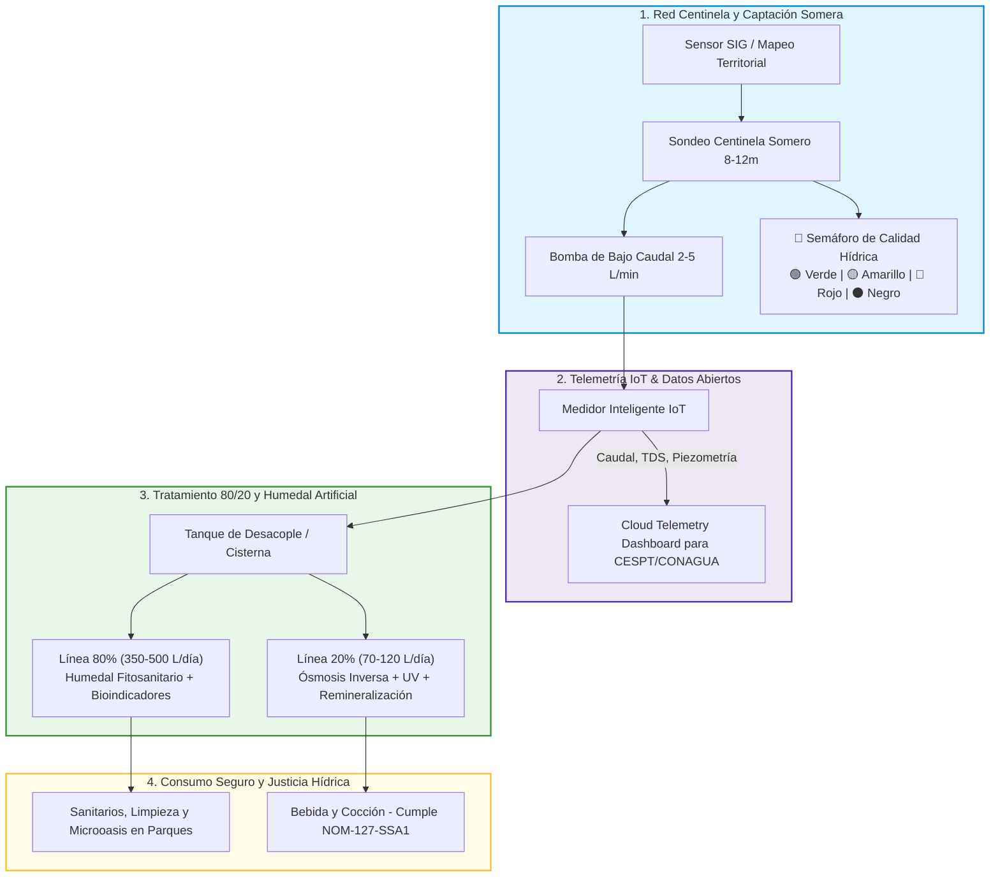
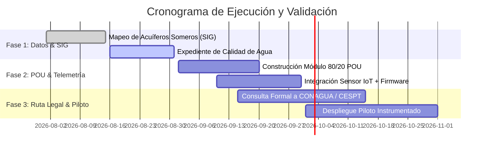

# 💧 AquaResiliencia Tijuana

<div align="center">

[](https://github.com/quecrap/123portijuana)
[](https://github.com/quecrap/123portijuana)
[](https://github.com/quecrap/123portijuana)
[](https://github.com/quecrap/123portijuana)
[](https://github.com/quecrap/123portijuana)

**Plataforma de Inteligencia Territorial, Extracción Somera Frugal, Tratamiento POU 80/20 y Telemetría Regulada.**

*Transformando un hallazgo empírico de captación hídrica en una solución replicable, científica, legal y sanitariamente viable para el contexto urbano de Tijuana.*

---

</div>

## 📑 Tabla de Contenidos

1. [Visión y Mensaje Maestro](#-visión-y-mensaje-maestro)
2. [El Problema en Números](#-el-problema-en-números-vs-nuestra-solución)
3. [Arquitectura del Sistema](#-arquitectura-del-sistema)
4. [La Estrategia 80/20 (Point-of-Use)](#-la-estrategia-8020-point-of-use)
5. [Evidencia y Prototipo (Caso 001)](#-evidencia-y-prototipo-caso-001)
6. [Marco Normativo y Regulatorio](#-marco-normativo-y-regulatorio)
7. [Estructura del Repositorio](#-estructura-del-repositorio)
8. [Hoja de Ruta (Stage-Gate 90 Días)](#-hoja-de-ruta-stage-gate-90-días)
9. [Seguridad y Privacidad de Datos](#-seguridad-y-privacidad-de-datos)

---

## 🎯 Visión y Mensaje Maestro

> **"Ya demostramos que una perforación frugal puede alcanzar agua somera en un sitio de Tijuana. El proyecto ahora consiste en convertir ese hallazgo en una plataforma capaz de decidir dónde funciona, qué agua encuentra, para qué usos es segura, cuánto cuesta tratarla y bajo qué reglas puede autorizarse."**

AquaResiliencia no propone una "perforación indiscriminada", sino una **infraestructura distribuida de resiliencia hídrica doméstica** que combina:
- **Inteligencia Territorial:** Mapeo hidrogeológico SIG para identificar niveles freáticos someros y evitar pozos ciegos.
- **Extracción Frugal Asistida:** Métodos de bajo impacto con bombeo solar/eléctrico de bajo caudal para evitar abatimiento.
- **Tratamiento Diferenciado 80/20:** Desacoplamiento del agua de uso general vs. agua de ingesta bajo norma NOM-127-SSA1.
- **Telemetría Regulada IoT:** Medición de flujo, nivel estático/dinámico y conductividad en tiempo real.
- **Cumplimiento Legal Proactivo:** Gobernanza alineada a CONAGUA y normativas del Acuífero 0201 Tijuana.

---

## 📊 El Problema en Números vs. Nuestra Solución

| Dimensión | Situación Tradicional en Periferias | Solución AquaResiliencia |
| :--- | :--- | :--- |
| **Acceso al Agua** | Dependencia crítica de pipas (costo 5x–10x vs. red) y cortes recurrentes. | Fuente somera local de respaldo continuo a bajo caudal (2–5 L/min). |
| **Costo de Infraestructura** | Perforaciones profundas industriales ($150,000–$400,000+ MXN). | Sistema modular frugal POU de bajo costo con herramientas móviles reutilizables. |
| **Tratamiento y Calidad** | Intentar potabilizar el 100% del volumen (antieconómico por sales/metales). | **Arquitectura 80/20:** El 80% acondiciona servicios; el 20% se ultra-purifica. |
| **Gobernanza & Datos** | Extracciones clandestinas no registradas que sobreexplotan mantos. | **Telemetría IoT transparente** con bitácora digital y control de abatimiento. |

---

## ⚙️ Arquitectura del Sistema



---

## 🔬 La Estrategia 80/20 & Humedales Artificiales

En una vivienda o nodo barrial típico, de **350 a 600 litros diarios** de consumo:

```
┌─────────────────────────────────────────────────────────────────────────┐
│ TOTAL DEL VOLUMEN EXTRAÍDO (100%)                                       │
├────────────────────────────────────────────────────┬────────────────────┤
│ 80% — USO GENERAL & REGENERACIÓN (~300–480 L/día) │ 20% — INGESTA      │
│ • Humedal artificial: grava, arena y fitorremedio │ (~70–120 L/día)    │
│ • Bioindicadores acuáticos (Validación biológica) │ • Cocina y bebida  │
│ • Riego de parques/microoasis y sanitarios         │ • RO + Remin + UV  │
└────────────────────────────────────────────────────┴────────────────────┘
```

> **Principio de Eficiencia y Justicia Hídrica:** Desacoplar usos permite purificar al 100% de calidad NOM-127 únicamente el volumen de ingesta, mientras el 80% regenera el entorno verde mediante biotecnología pasiva de bajísimo costo.

---

## 🛠️ Evidencia y Prototipo (Caso 001)

- **Ubicación:** Zona piloto en el municipio de Tijuana (depósito aluvial somero).
- **Profundidad alcanzada:** 8–9 metros con método hidrocirulación PVC + bentonita.
- **Caudal instantáneo:** ~2 Litros/minuto.
- **Tiempo de ejecución:** ~8 horas de operación.
- **Conclusión técnica:** Validación de viabilidad física de captación somera de bajo costo.

---

## ⚖️ Marco Normativo y Regulatorio

1. **Acuífero 0201 (Tijuana):** Se encuentra bajo veda y balance administrativo deficitario según publicaciones de CONAGUA. El proyecto opera bajo enfoque de **estudio, monitoreo y respaldo doméstico**, promoviendo consultas formales escritas y telemetría abierta.
2. **Norma Oficial Mexicana NOM-127-SSA1:** Establece los límites permisibles de calidad de agua para consumo humano. Nuestro módulo 20% POU está diseñado específicamente para cumplir esta norma mediante triple barrera (microfiltración, ósmosis inversa, desinfección UV).
3. **Principio de Legalidad:** No se promueve la apertura clandestina. Se busca protocolizar la ruta de autorización para captaciones someras de investigación y mitigación comunitaria.

---

## 📁 Estructura del Repositorio

```
123portijuana/
├── .gitignore              # Protección estricta de archivos multimedia y datos privados
├── README.md               # Presentación formal, arquitectura y visión del proyecto
├── PLAN_MAESTRO.md         # Documento maestro (37,500+ palabras): técnica, leyes y finanzas
├── STORYBOARD.md           # Guía narrativa visual, especificaciones de arte y prompts de IA
└── GUION_CAPCUT.md         # Guion de producción audiovisual (60s Pitch y 30s Redes)
```

### Documentos Destacados:
- 📖 [**PLAN_MAESTRO.md**](PLAN_MAESTRO.md) — *Lectura obligatoria para el equipo e inversionistas.*
- 🎬 [**STORYBOARD.md**](STORYBOARD.md) — *Identidad audiovisual y prompts de generación.*
- 🎙️ [**GUION_CAPCUT.md**](GUION_CAPCUT.md) — *Tiempos, overlays y locución para video.*

---

## 🚀 Hoja de Ruta (Stage-Gate 90 Días)



---

## 🔒 Seguridad y Privacidad de Datos

> [!IMPORTANT]
> Todo el material audiovisual real (fotografías de predios, rostros de colaboradores y coordenadas geográficas exactas de los prototipos) se mantiene bajo almacenamiento encriptado privado fuera del repositorio público para cumplir con la legislación de protección de datos personales y salvaguardar la seguridad de los predios piloto.

---

<div align="center">

**AquaResiliencia Tijuana** — *Construyendo resiliencia hídrica con ciencia, datos y comunidad.*  
Hecho con dedicación en Baja California, México 🇲🇽

</div>
